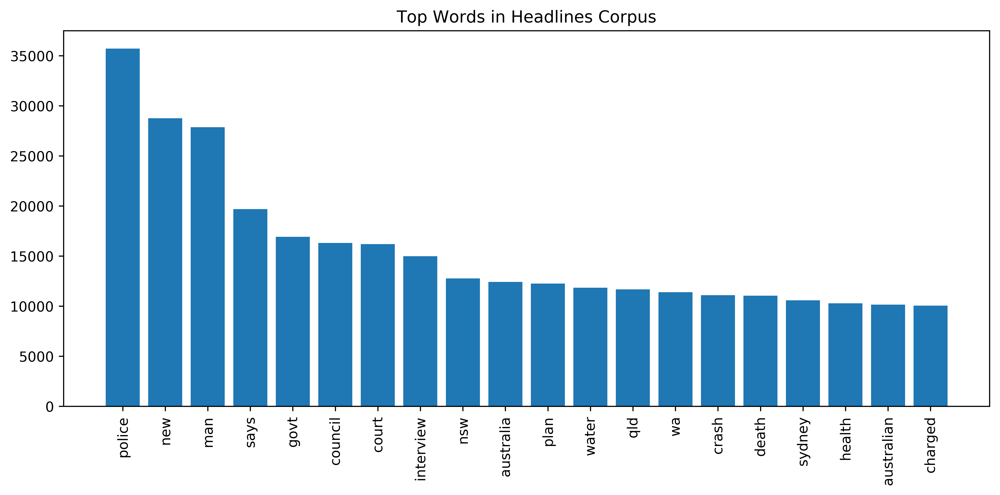
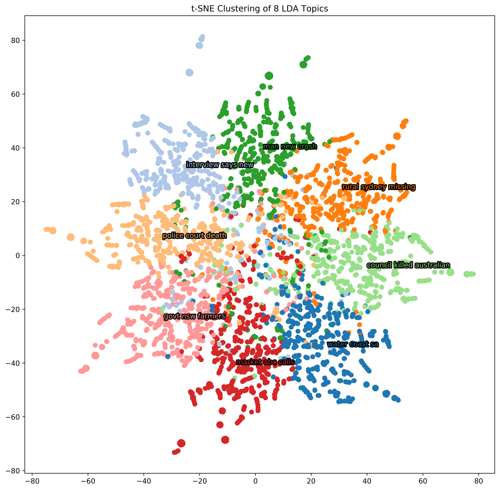

*In this post, two typical NLP techniques are explored in relation to the problem of topic modelling. These are applied to the 'A Million News Headlines' dataset, which is a corpus of over one million news article headlines published by the ABC.*

# Introduction

## Motivating the Problem

Topic modelling is a classic problem in the domain of natural language processing. Given a corpus of text \\(C\\) composed of \\(n\\) documents, the goal is to uncover any latent topic structure that may exist within the data. In other words, we are seeking to discover the set of topics \\(\mathcal{T}\\) with which a given series of documents are concerned, and having done so, sort these documents into the differing topic categories. Since we do not know a priori exactly what these topics are, this is an *unsupervised* problem: we have only unlabelled input data, and must determine the topic categories endogenously. In many respects, topic modelling is therefore quite similar to a clustering problem – by 'modelling topics', we are essentially just clustering the text headlines, where the clusters now have an additional interpretation as topic categories. The primary difference is that we are now working in some abstract 'word' space, rather than a more conventional Euclidean vector space in \\(\mathbb{R}^p\\)

LSA and LDA represent two distinct approaches to solving this problem. Each draws upon very different mathematical procedures, and will have varying success depending upon the type of text data that is supplied as input. As we shall however see, both can be implemented in very similar ways, affording us ample scope for an exploration of their respective strengths and weaknesses.

## The Dataset

### Background

The dataset which we will be using for our exploration of topic modelling is the 'A Million News Headlines' corpus, published by the ABC. This is a set of over one million news article headlines taken from the Australian public broadcaster's news division, collected between 2003 and 2017. Further details can be found on [the Kaggle page](https://www.kaggle.com/therohk/million-headlines). In their raw form, the headlines are available simply as a series of text strings, accompanied by a publish date. Some examples are given below.

| Publish Date | Headline                                         |
| ------------ | ------------------------------------------------ |
| 2003-02-19   | businesses should prepare for terrrorist attacks |
| 2004-05-12   | councillor to contest wollongong as independent  |
| 2017-09-30   | san juan mayor mad as hell over us hurricane     |

More typically, topic modelling is conducted upon longer-form text data – perhaps entire news articles, or extracts from novels, or Wikipedia pages. For intuitive reasons, longer text samples are indeed preferable; more words means a richer snapshot of potential topics and a more diverse topic vocabulary. However, thanks to the succinct and lucid nature of news article headlines, we can still expect a robust kernel of semantic content, and paired with the massive number of datapoints available, it is unlikely that our analysis will suffer for this lack of depth.

### Feature Construction

As with most forms of text analysis, the text data must first be preprocessed before it can be used as input to any algorithm (for the moment, we will disregard the publish date). In our case, this will mean converting each headline into a (very long) vector, where each entry corresponds to the number of occurences of a particular word. Effectively, this is equivalent to walking through the string with a dictionary in hand, adding a check next to each word in the dictionary as they appear. The resulting list of word counts then becomes the vector associated with that string.
\\[
\text{''the cat in the hat''} \longrightarrow \begin{bmatrix} 1 \\\ 0 \\\ 2 \\\ 0 \\\ 0 \\\ \vdots \\\ 1 \\\ 0 \end{bmatrix} \in \begin{bmatrix} \text{cat} \\\ \text{fantastic} \\\ \text{the} \\\ \text{fox} \\\ \text{machine} \\\ \vdots \\\ \text{in} \\\ \text{chocolate} \end{bmatrix}
\\]
This approach is known as a **bag of words** representation, in that it reduces each text string to just a collection of word counts and disregards the actual ordering of words. Of course, encoding features in this way involves a loss of information, and a more sophisticated approach might attempt to recognise specific sequences of words – but for our initial implementation, this is an acceptable simplification.

*It is worth noting that this process of vectorisation has several variations. Rather than the naive approach taken above, a common alternative is [term frequency–inverse document frequency](https://en.wikipedia.org/wiki/Tf–idf) or TFIDF. This computes the relative frequency of words in a document compared to the whole corpus, partially in attempt to counteract the greater significance that a longer document would have over a shorter one if raw counts were used. However, given that we are working with a corpus of text strings of relatively equal length—and moreover, strings which are all very short—the naive approach is perfectly reasonable.*

Vectorizing all \\(n\\) headlines in this manner will ultimately yield an \\(n \times K\\) **document-term matrix**, where each row corresponds to a headline and each column corresponds to a distinct word. The exact set of words chosen—i.e. our actual feature set—must be selected exogenously: the goal is to generate a diverse feature space while at the same time preventing the data from being too high-dimensional. For this reason, we typically use the top \\(M\\) most frequent words in the corpus while also omitting a set of common 'stop words' – trivial prepositions and conjunctions (e.g. the, in, at, that, to). This 'middle band' of vocabulary should then give rise to a concise but meaningful set of features (words) that suffices to capture the key variation in the data. To recap: the table of one million headline text strings has been converted to a document-term matrix \\(D\\), which can now be used as input to our topic model.
\\[
\begin{bmatrix} \text{the cat in the hat} \\\ \text{green eggs and ham} \\\ \vdots \\\ \text{horton hears a who} \end{bmatrix}
\longrightarrow
\underbrace{
\begin{bmatrix}
1 & 0 & 2 & 0 & 0 & \cdots & 1 & 0 \\\
0 & 1 & 0 & 0 & 1 & \cdots & 0 & 1 \\\
\vdots & \vdots & \vdots & \vdots & \vdots & & \vdots & \vdots \\\
0 & 0 & 0 & 1 & 0 & \cdots & 0 & 0
\end{bmatrix}
}_{D}
\\]

## A Brief Review of LSA and LDA

Before embarking upon our analysis, let's briefly outline the two techniques that are to be employed. The first of these is Latent Semantic Analysis, more typically referred to as LSA. At its heart, this is fundamentally just a matrix factorisation procedure: given a document-term matrix \\(D\\), the algorithm first performs singular value decomposition, and then truncates all but the \\(r\\) largest singular values. Instead of the usual SVD factorisation,
\\[
D = U \Sigma V^T
\\]
we therefore use
\\[
 T = U \hat{\Sigma} V^T
\\]
where \\(\hat{\Sigma}\\) is the matrix of singular values \\(\Sigma\\) with all but the \\(r\\) largest singular values set to zero. The resulting matrix \\(T\\) is thus of reduced rank, and is referred to as the **topic matrix**. Each of its \\(n\\) rows will represent a document, and each of the first \\(r\\) columns will correspond to a topic; the \\((i, j)\\)th entry can then be considered a measure of the presence of topic \\(j\\) in document \\(i\\). To actually sort a document into a topic category, we simply take the \\(\arg \max\\) of each row, as this will correspond to the most strongly-represented topic. Note too that \\(r\\) is a parameter here, and must be supplied as an input to the algorithm. In other words, the number of topic categories must be provided exogenously – not all of the decision are made internally by the algorithm.

Meanwhile, Latent Dirichilet Allocation takes an entirely different approach. Rather than a matrix decomposition, it is instead a generative probabilistic process. It views documents—in this case, headlines—as probability distributions over latent topics, and these topics to be probability distributions over words. As such, the technique supposes that headlines are generated according to the following:
1. Pick a number of words in the headline.
2. Choose a topic mixture for the headline, over a fixed number of topics.
3. Generate the words in the headline by picking a topic from the headline’s multinomial distribution, and then picking a word based upon the topic’s multinomial distribution.

To actually sort the headlines into topic clusters, LDA then works backwards: starting from Dirichilet priors, variational Bayes methods are used to infer the latent distributional parameters, which then characterise the differing topics. As with LSA, the actual number of topics \\(r\\) must be supplied as a hyperparameter here. The output will then once again be in the form of a topic matrix \\(T\\), though each of the rows are now effectively a probability distribution defined over the topics for each document. As such, the \\((i,j)\\)th entry of this topic matrix can now be interpreted as a probability that headline \\(i\\) belongs to topic \\(j\\) (or rather, as a proportion of the words in the headline which fall into topic \\(j\\)). Hence by taking the \\(\arg \max\\) of each row, we again obtain an estimated topic category for each headline.

# Analysis

Having set the scene, we can now dive into developing our topic models. All key code snippets are featured below, though a more complete Python script can be found the GitHub page linked above.

### Exploratory Data Analysis

As usual, it is prudent to begin with some basic EDA. We first develop a list of the top words used across all one million headlines, giving us a glimpse into the core vocabulary of the source data. Stop words are omitted here to avoid any trivial prepositions and conjunctions.



Even from this initial distribution, several topics are hinted at. Headlines describing crime and violence seem to appear frequently ('police', 'court', 'crash', 'death' and 'charged'), and politics also demonstrates a presence ('govt', 'council', 'nsw', 'australia', 'qld', 'wa'). Of course, these assocations are a little tenuous, but manifest structure of this kind is certainly encouraging for our later application of LSA and LDA.

Next we generate a histogram of headline word lengths, and use [part-of-speech tagging](https://en.wikipedia.org/wiki/Part-of-speech_tagging) to understand the types of words used across the corpus. This can be done using the TextBlob library, which incorporates a speech tagging function ```pos_tags``` that can be used to generate a list of tagged words for each headline. A complete list of such word tags is available [here](https://www.clips.uantwerpen.be/pages/MBSP-tags).

```python
> tagged_headlines = pd.DataFrame(
>   {'tags':[TextBlob(headlines_data[i]).pos_tags
>                            for i in range(headlines_data.shape[0])]})
>
> word_counts = []
> pos_counts = {}
>
> for headline in tagged_headlines['tags']:
>     word_counts.append(len(headline))
>     for tag in headline:
>    	if tag[1] in pos_counts:
>         	pos_counts[tag[1]] += 1
> 		else:
> 			pos_counts[tag[1]] = 1
```

From the histogram, we can see that the headlines are approximately normally distributed in length, with most composed of between five and eight words. This certainly validates our naive use of word counts over TFIDF! Meanwhile, the results of the POS tagging are also encouraging: a significant portion of the vocabulary in the corpus are nouns (NN, NNS), which are much more likely to be topic-specific than any other part of speech.


### Preprocessing
The only preprocessing step required in our case is feature construction, discussed above. This can be done using the ```CountVectorizer``` object from SKLearn, which takes as input a list of text strings and yields an \\(n \times K\\) document-term matrix. In this case, we set \\(K = 40,000\\), denoting the \\(40,000\\) most common words across the \\(n\\) headlines in our sample (less stop words).

```python
> count_vectorizer = CountVectorizer(stop_words='english', max_features=40000)
> text_sample = reindexed_data.sample(n=10000, random_state=0).as_matrix()
>
> print('Headline before vectorization: {}'.format(text_sample[0]))
>
> document_term_matrix = count_vectorizer.fit_transform(text_sample)
>
> print('Headline after vectorization: \n{}'.format(document_term_matrix[0]))

Headline before vectorization:  barr on federal budget preview
Headline after vectorization:
  (0, 8418)	1
  (0, 1743)	1
  (0, 4156)	1
  (0, 1165)	1
```

It is worth noting here that the document-term matrix has been stored by SciPy as a sparse matrix. This is a key idiosyncracy that often arises in NLP analysis – given we are working with such high-dimensional features, it is crucial that data be stored as efficiently as possible (maintaining \\(1,000,000 \times 40,000 = 40 \ \text{billion}\\) floating point numbers in memory is certainly not feasible!). Luckily, the bag of words model means that most of the entries in a document-term matrix are zero, since most pieces of text are composed of only a small fraction of the total allowed vocabulary. As such the document-term matrix \\(D\\) is highly sparse, and this can be taken advantage of when performing matrix operations.

Thus we have constructed our input data, ```document_term_matrix```, and can now actually implement a topic modelling algorithm. Both LSA and LDA will take our document-term matrix as input and yield an \\(n \times N\\) topic matrix as output, where \\(N\\) is the number of topic categories (which we supply as a parameter, as discussed above). For the moment, 8 would seem to be a reasonable number; any more and we would risk being overly granular with the topic categories, any fewer and we would be grouping together potentially unrelated content. Nonetheless, this can be experimented with later.

```python
> n_topics = 8
```

## Latent Semantic Analysis

Let's start by experimenting with LSA. This can be easily implemented using the ```TruncatedSVD``` class in SKLearn.

```python
> from sklearn.decomposition import TruncatedSVD
>
> lsa_model = TruncatedSVD(n_components=n_topics)
> lsa_topic_matrix = lsa_model.fit_transform(document_term_matrix)
```

Taking the \\(\arg \max\\) of each headline in this topic matrix will give the predicted topics of each headline in the sample. We can then sort these into counts of each topic. However, these topic categories are in and of themselves a little meaningless. In order to better characterise them, it will be helpful to find the most frequent words in each.

```python
> top_n_words_lsa = get_top_n_words(10, lsa_keys,
>                                 document_term_matrix, count_vectorizer)
>
> for i in range(len(top_n_words_lsa)):
> 	print("Topic {}: {}".format(i, top_n_words_lsa[i]))

Topic 0:  police death car missing murder sydney search probe home woman
Topic 1:  new world centre iraq laws open record hospital coach time
Topic 2:  man charged murder dies court jailed death arrested rape guilty
Topic 3:  says health government group sa market labor mp farmers school
Topic 4:  court accused case face drug woman faces high told hears
Topic 5:  govt nsw qld wa report urged industry claims act workers
Topic 6:  council australia water australian crash plan rural talks day residents
Topic 7:  interview north michael afl smith speaks nrl clarke james tim
```

Hence we have converted our initial small sample of headlines into a list of predicted topic categories, where each category is characterised by its most frequent words. The relative magnitudes of each of these categories can then be easily visualised though use of a bar chart.


Several insights are apparent here. It is clear that LSA has successfully delineated some intuitive topic categories: Topics 0 and 2 appear to be 'Crime', Topic 4 could be 'Legal Proceedings', Topic 5 'National Politics', and Topic 2 'World Affairs'. The distribution of topics is also non-uniform, suggesting—as would be expected—that certain topics are more prevalent than others in news reporting. Both of these outcomes therefore represent confirmations of a prior belief, which is encouraging.

However, this output does not provide a great point of comparison with other clustering algorithms. In order to properly contrast LSA with LDA we instead use a dimensionality-reduction technique called \\(t\\)-SNE, which will also serve to better illuminate the success of the clustering process. \\(t\\)-SNE takes each of the \\(n\\) vectors from the topic matrix and projects them from \\(N\\) dimensions to two dimensions, such that they can be visualised in a scatter plot. The way \\(t\\)-SNE functions is a little opaque, and it is beyond the scope of this post to discuss its workings in detail (see [this article](https://distill.pub/2016/misread-tsne/) for a great exploration of its properties), though it has been proven to yield great results on non-linear datasets such as our topic matrix. It can also be implemented in SKLearn, though it has a relatively long runtime even on our small sample.

```python
> from sklearn.manifold import TSNE
>
> tsne_lsa_model = TSNE(n_components=2, perplexity=50,
>                      learning_rate=100, n_iter=2000, verbose=1,
>                      random_state=0, angle=0.75)
> tsne_lsa_vectors = tsne_lsa_model.fit_transform(lsa_topic_matrix)
```

Now that we have reduced these `n_topics`-dimensional vectors to two-dimensional representations, we can plot the clusters. Also included are the top three words in each cluster, which are placed at the centroid for that topic.


Evidently, this is a bit a of a failed result. While the topic categories derived above appeared to be generally coherent, the scatterplot makes it clear that separation between these categories is poor. Such a lack of clarity was in fact hinted at earlier, when we generated the top ten words in each topic: several words were frequent in multiple topics, suggesting a failure to distinguish between content. And perhaps most obviously, the centroid locations for each topic cluster are completely nonsensical. Nonetheless, it is difficult to tell whether this can be attributed to the LSA decomposition or instead the \\(t\\)-SNE dimensionality reduction process. Let's move forward and experiment with another topic modelling technique to see if we can improve upon this outcome.

## Latent Dirichilet Allocation

We now repeat this process using LDA instead of LSA. Once again, SKLearn provides a very simple implementation via its ```LatentDirichletAllocation``` class.

```python
> from sklearn.decomposition import LatentDirichletAllocation
>
> lda_model = LatentDirichletAllocation(n_components=n_topics,
>                            learning_method='online', random_state=0, verbose=0)
> lda_topic_matrix = lda_model.fit_transform(document_term_matrix)
```

Once again, we take the \\(\arg \max\\) of each entry in the topic matrix to obtain the predicted topic category for each headline. These topic categories can then be characterised by their most frequent words.

```python
> top_n_words_lda = get_top_n_words(10, lda_keys,
>                                 document_term_matrix, count_vectorizer)
>
> for i in range(len(top_n_words_lda)):
> 	print("Topic {}: {}".format(i, top_n_words_lda[i]))

Topic 0:  water coast sa gold china time public fight says police
Topic 1:  interview says new plan government talks iraq wins plans funding
Topic 2:  rural sydney missing qld wa home health claims search residents
Topic 3:  police court death woman south man australia probe assault state
Topic 4:  man new crash charged report world police road cup fatal
Topic 5:  council killed australian car murder budget group industry hit support
Topic 6:  market abc calls says news win national adelaide australia rise
Topic 7:  govt nsw farmers trial drought pm act inquiry work new
```

The relative topic compositions of the topics are then illustated with a barchart.


Already, we see starkly different results from those generated by LSA. The topics that have been delineated are distinct, and are in fact less coherent – no obvious interpretations jump out, other than perhaps 'Crime' for Topic 3 and Topic 4. Moreover, the distribution of topics is much flatter. This is likely a consequence of the variational Bayes algorithm, which begins with equal priors across all \\(N\\) categories and only gradually updates them as it iterates through the corpous. While such a flat distribution may not seem especially significant, it may reflect deeper problems with the algorithm; in effect, LDA is telling us that the headlines are an almost-equal mix of the \\(N\\) categories, which we would not necessarily expect to be an intuitive result.

Nonetheless, in order to properly compare LDA with LSA, we again take this topic matrix and project it into two dimensions with \\(t\\)-SNE.

```python
> from sklearn.manifold import TSNE
>
> tsne_lda_model = TSNE(n_components=2, perplexity=50,
>                     learning_rate=100, n_iter=2000, verbose=1,
>                     random_state=0, angle=0.75)
> tsne_lda_vectors = tsne_lda_model.fit_transform(lda_topic_matrix)
```



This now appears a much better result! Controlling for \\(t\\)-SNE, it would seem that LDA has had a lot more succcess than LSA in separating out the topic categories. There is much less overlap between the clusters, and each topic has been sorted into an almost-contiguous region. Clearly, LDA is capable of generating a much more intelligible projection of the headlines into topic space (most likely because this topic space is indeed a probability space), but this must certainly be taken with a grain of salt given the lack of coherence of these topic clusters discussed above.

# Conclusions

Each of the two algorithms has had varying degrees of success. While LSA generated a more coherent topic-set and a more reasonable topic distribution, it did not succeed in attaining great separation between these clusters. LDA instead achieved nearly the opposite: separation between topics was very good, but the topics derived were not especially intelligible, and their distribution seemed unlikely. As usual, we find that the No Free Lunch principle holds. Topic modelling is a fundamentally hard problem!

Nonetheless, our results are broadly encouraging. The potential for delineation and coherence of topics in the headlines data has been made apparent, and several fundamental properties of the dataset have been illuminated. There may of course be scope for improvement: hyperparameters could be tuned (the number of topics \\(N\\) could be varied to try and obtain a more interpretable topic set, LDA's Dirichilet priors could be tailored to better suit the data, \\(t\\)-SNE could be played around with to try and improve projections from topic space to two-dimesions, and so on), and more time could also be spent on feature construction, to perhaps further reduce down the size of the vocabulary set. But regardless, the above explorations establish a strong foundation for any further analyses of the headlines dataset – and moreover, clearly demonstrate the viability of topic modelling on an ostensibly novel data format.
